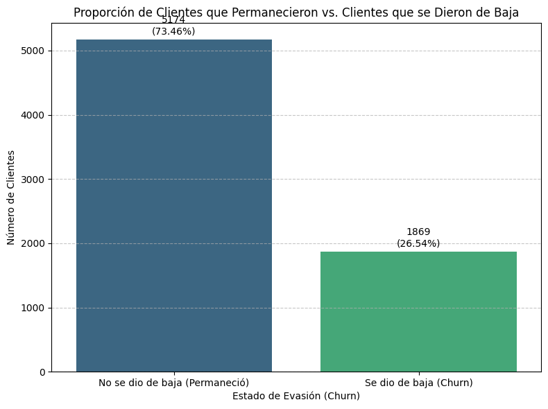
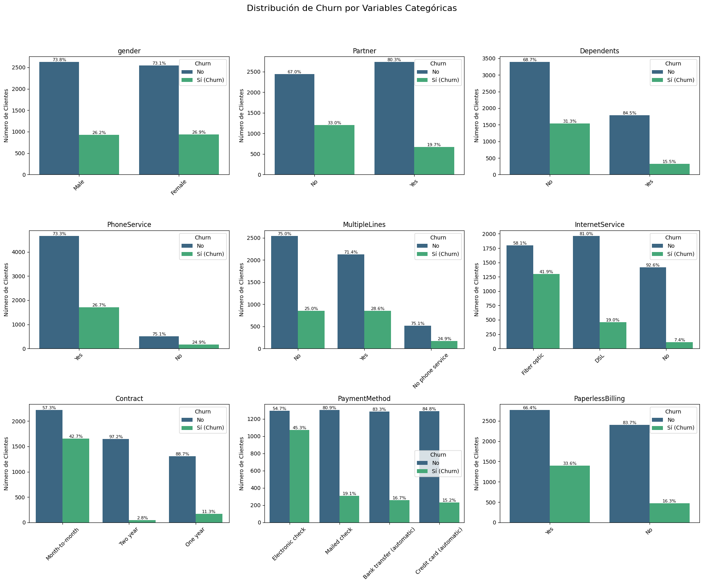
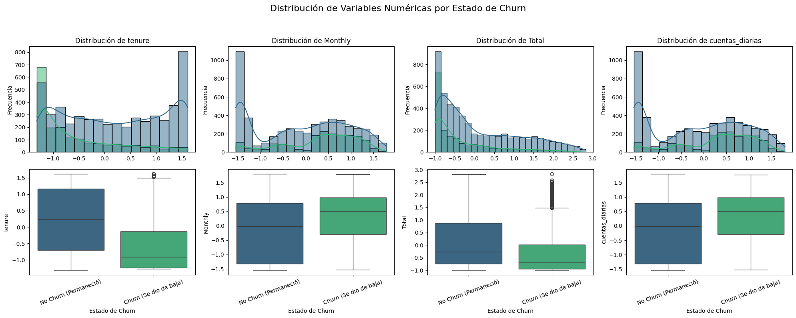

# 📉 Análisis de Evasión de Clientes (Churn)

## 🚀 Visión General del Proyecto

Este proyecto tiene como objetivo analizar la evasión de clientes (churn), un desafío crítico para el crecimiento y la rentabilidad de las empresas de servicios. A través del análisis de datos, se identifican los factores clave que influyen en la cancelación del servicio, con el fin de diseñar estrategias efectivas de retención.

## 🎯 Objetivos del Análisis

* Identificar variables demográficas, de servicio y de cuenta asociadas con la probabilidad de churn.
* Cuantificar la proporción de clientes que abandonan el servicio frente a los que se mantienen.
* Generar insights accionables que permitan reducir la tasa de churn.

## 📊 Descripción del Dataset

Fuente de datos: [datos.json](https://raw.githubusercontent.com/lMVPl/analisis-evasion-de-clientes/refs/heads/main/datos.json)

El archivo contiene datos detallados de clientes organizados en estructuras anidadas, con variables como:

* **`customerID`**: Identificador único
* **`Churn`**: Variable objetivo (Yes/No)
* **`customer.*`**: Datos demográficos (género, estado civil, dependientes, antigüedad)
* **`phone.*`**: Información del servicio telefónico
* **`internet.*`**: Tipo de servicio y servicios adicionales
* **`account.*`**: Tipo de contrato, facturación, método de pago y cargos

---

## 🛠️ Metodología

### 1. Carga y Preparación de Datos

* Normalización de estructuras anidadas usando `pandas.json_normalize`.
* Renombrado con prefijos (ej. `customer.gender`) para claridad y evitar conflictos.
* Creación de nueva variable `cuentas_diarias = account.Charges.Monthly / 30`.

### 2. Limpieza y Transformación

* **Categóricas**: Normalización de texto (`.str.lower()`, `.strip()`, `.replace()`).
* **Numéricas**: Conversión de tipos y manejo de valores no válidos (ej. cargos vacíos).
* **Churn**: Reconvertido a binario (`0 = No`, `1 = Yes`) y depurado.

### 3. Preparación para Modelado

* **One-Hot Encoding**: Todas las variables categóricas excepto `customerID` y `Churn`.
* **Estandarización**: Variables numéricas transformadas con `StandardScaler`.

### 4. Análisis Exploratorio (EDA)

* **Distribución de Churn**: Gráficos de barras para visualizar desequilibrio de clases.
* **Variables Categóricas vs. Churn**: Countplots para analizar patrones (género, contrato, método de pago, etc.).
* **Variables Numéricas vs. Churn**: Boxplots y KDE/histogramas para visualizar diferencias según churn (antigüedad, cargos mensuales/totales, cuentas\_diarias).

---

## 💡 Insights Relevantes

* **Antigüedad**: El predictor más fuerte. Clientes nuevos (tenure bajo) presentan mayor riesgo de churn.
* **Cargos**:

  * **Altos cargos mensuales/diarios** → Mayor churn.
  * **Bajo cargo total acumulado** → Refuerza el riesgo en clientes nuevos con poca inversión.
* **Tipo de Contrato**: Contratos mes a mes tienen tasas de churn más altas que los anuales.
* **Servicios Adicionales y Métodos de Pago**: Ausencia de servicios como soporte técnico y ciertos métodos de pago (ej. cheque electrónico) se asocian con más evasión.

---

## 📝 Recomendaciones Estratégicas

1. **Retención Temprana**

   * Programas de bienvenida y seguimiento durante los primeros 3–6 meses.
   * Beneficios exclusivos para clientes nuevos.

2. **Revisión del Valor-Precio**

   * Ajustes en planes de alto costo o refuerzo del valor percibido.
   * Promociones o comunicación clara de beneficios.

3. **Fomento del Compromiso**

   * Incentivos para migrar a contratos de largo plazo.

4. **Promoción de Servicios Clave**

   * Resaltar beneficios de servicios como seguridad online o soporte técnico.

5. **Optimización de Métodos de Pago**

   * Analizar posibles barreras o fricciones ligadas a métodos de pago asociados con alta evasión.

---

## 📁 Estructura del Proyecto

```bash
├── img/
│   └── Distribucion-Churn-por-variable-categorica.png
│   └── Distribucion-Churn-por-variable-numerica.png
│   └── Grafico-proporcion-de-Churn.png
├── README.md
├── TelecomX_Analisis_evasión_de_clientes.ipynb
├── datos.json
```

---

## 📷 Visualizaciones Clave

A continuación se presentan algunas visualizaciones destacadas obtenidas durante el análisis:



*Figura 1: Distribución de clientes según churn.*


*Figura 2: Distribución de Churn por variable categorica.*


*Figura 3: Distribución de Churn por variable numérica.*

